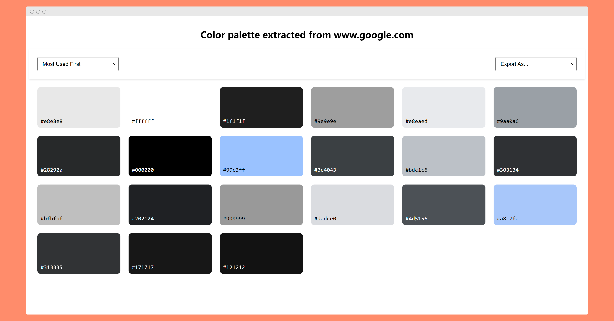

<div id="top"></div>

<div align="center">
  <h1>Site Color Palette Extractor</h1>
  <p>A Chrome extension that extracts and analyzes color palettes from any website.</p>
  <a href="https://chromewebstore.google.com/detail/site-color-palette-extrac/anppkchfheboehadjffljijfkblldnpp">Download on Chrome Web Store</a>
</div>

## About The Project

Site Color Palette Extractor helps designers and developers understand and
export color schemes from any website. It identifies both background and text
colors, shows their usage frequency, and exports them in various formats
suitable for different workflows.



### Features

- Quick color palette preview
- Detailed color analysis
- Multiple export formats (CSS, SCSS, Tailwind, JSON, PDF, PNG, ASE)
- Background/text color filtering
- Color usage statistics

### Built With

- Vanilla JavaScript
- Chrome Extension APIs
- jsPDF for PDF generation
- html2canvas for PNG export

## Installation

1. Clone the repository
   ```sh
   git clone https://github.com/htmlHxcker/site-colour-extractor.git
   ```
2. Open Chrome and navigate to chrome://extensions/
3. Enable "Developer mode"
4. Click "Load unpacked" and select the extension directory

## Usage

1. Click the extension icon on any webpage
2. View the quick color palette
3. Click "View Detailed Report" for in-depth analysis
4. Export colors in your preferred format

## Contributing

1. Fork the Project
2. Create your Feature Branch (`git checkout -b feature/AmazingFeature`)
3. Commit your Changes (`git commit -m 'Add some AmazingFeature'`)
4. Push to the Branch (`git push origin feature/AmazingFeature`)
5. Open a Pull Request

## License

Distributed under the MIT License.

## Acknowledgments

- [The Color API](https://www.thecolorapi.com/) for color identification
- [jsPDF](https://artskydj.github.io/jsPDF/) for PDF generation
- [html2canvas](https://html2canvas.hertzen.com/) for PNG export
